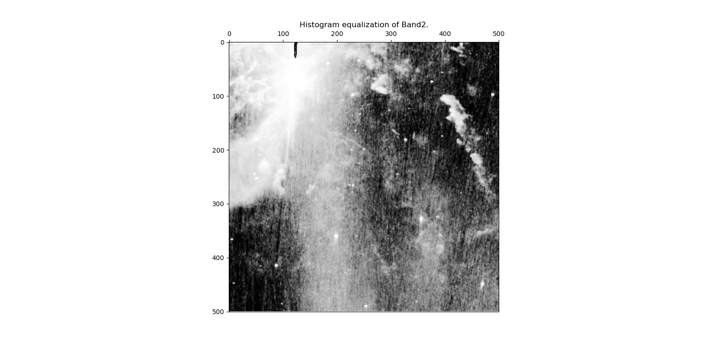
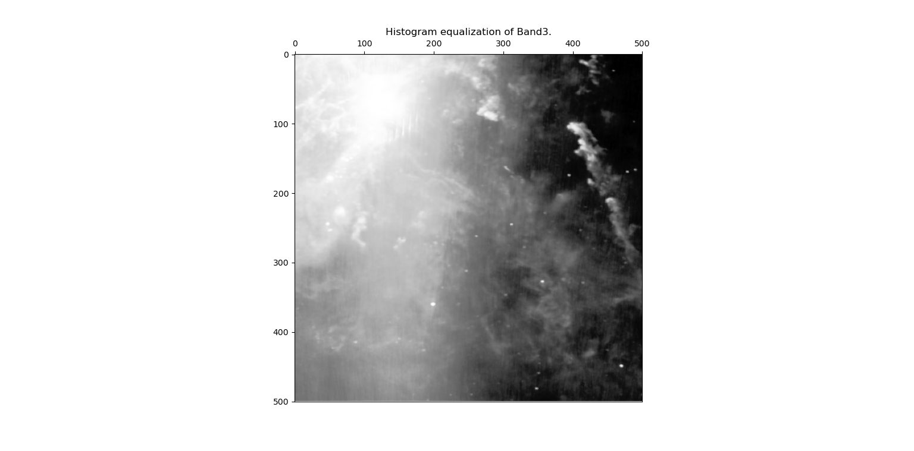

# Interactive Data Visualization Course

This is the archive for my assignments to the Master Course [Interactive Data Visualization (SS 2020)](https://cs.uni-paderborn.de/en/cgvb/lehre/vergangene-semester/ss-20/interactive-data-visualization) by Prof. Dr. Gitta Domik-Kienegger at [Paderborn University](https://www.uni-paderborn.de/en/), Germany.

**Note:** The assignment sheets include proprietary material owned by Sabrina Piasecki, [Paderborn University](https://www.uni-paderborn.de/en/), Germany. And please don't share.

## Table of Contents

1. [Assignment 1](#assignment-1)
2. [Assignment 2](#assignment-2)
3. [Assignment 3](#assignment-3)
4. [Assignment 4](#assignment-4)
5. [How To Run](#how-to-run)
6. [License](#license)

## Assignment 1

[Assignment_1 Description](Assignment_1\ass1_sheet.pdf).

**Task:** Effective visual identification of quickest and slowest movements of water particles in a channel due to wind forces.

**Output:**


**Feedback:**
1. Points: 5/10.
2. Use of color is incorrect, false information is conveyed.
3. Flow direction is not clear cause of areas with too small arrows and areas with too much overlapping

## Assignment 2

[Assignment_2 Description](Assignment_2\ass2_sheet.pdf).

**Task:** (a) Draw a profile line through line 256 of this 2D data set. 

**Output:**


**Task:** (b) Calculate the mean and the variance value of this 2D data set.

**Output:**
Mean = 949.99 and Variance = 134932.48

**Task:** (c) Display a histogram of this 2D data set.

**Output:**


**Task:** (d) Rescale values to range between 0 and 255 using a linear transformation.

**Output:**


**Task:** (e) Rescale values to range between 0 and 255 using a different (e.g. non-linear) transformation.

**Output:**


**Task:** (f) Use an 11x11 boxcar smoothing filter on the 2D data set.

**Output:**


**Task:** (g) Use an 11x11 median filter on the 2D data set.

**Output:**


**Feedback:**
1. Points: 8.75/10.
2. Axis title of profile line incorrect.
3. Histogram is incorrect.

## Assignment 3

[Assignment_3 Description](Assignment_3\ass3_sheet.pdf).

**Task:** (a) Calculate the max value, the min value, the mean value and the variance value of this 2D data set.

**Output:** Maximum value = 17092.306826, Minimum value = 1.71122371, Mean value = 7.341425385031528, and Variance value = 15761.151027464939.

**Task:** (b) Draw a profile line through the line with the maximum value of this 2D data set.

**Output:**


**Task:** (c) Display a histogram of this 2D data set.

**Output:**


**Task:** (d) Rescale values to range between 0 and 255 using your own transformation and display on your screen. Add a legend showing the new maximum and minimum value.

**Output:**


**Task:** (e) Carry out a Histogram equalization on each of the four bands and display on your screen.

**Output:**
<table>
  <tr>
    <td></td>
    <td></td>
  </tr>
  <tr>
    <td></td>
    <td></td>
  </tr>
</table>

**Task:** (f) Combine the histo-equalized data set to an RGB-image (b4=r, b3=g, b1=b).

**Output:**


**Feedback:**
1. Points: 12.50/15.
2. Log scale not used in profile line.
3. Histogram incorrect.
4. Legend missing in subtask (e).

## Assignment 4

**Task:** [Effective visual identification of quickest and slowest movements of water particles in a channel due to wind forces.](Assignment_1\ass1_sheet.pdf)

**Output:**


**Feedback:**
1. Points: 5/10.
2. Use of color is incorrect, false information is conveyed.
3. Flow direction is not clear cause of areas with too small arrows and areas with too much overlapping

## How to Run

This project uses Conda for managing environments and dependencies. The [`environment.yaml`](environment.yml) file contains the list of all dependencies needed to run the project.

Follow these steps to run the project:

1. **Install Conda**: If you haven't installed Conda yet, you can download it from [here](https://docs.conda.io/projects/conda/en/latest/user-guide/install/index.html). Follow the instructions for your specific operating system.

2. **Create a Conda environment**: Navigate to the project directory in your terminal and run the following command to create a new Conda environment based on the [`environment.yaml`](environment.yml) file:

    ```bash
    conda env create -f environment.yaml
    ```

    This will create a new Conda environment with the name specified in the [`environment.yaml`](environment.yml) file.

3. **Activate the Conda environment**: Use the following command to activate the newly created environment:

    ```bash
    conda activate covid-19
    ```    

4. **Run the project**: Now that the environment is set up and activated, you can run the project. If it's a Python script, use the following command:

    ```bash
    python COVID-19.py
    ```    

Remember to deactivate the Conda environment once you're done by using the `conda deactivate` command.

## License

This project is licensed under the MIT License - see the [LICENSE.md](LICENSE.md) file for details